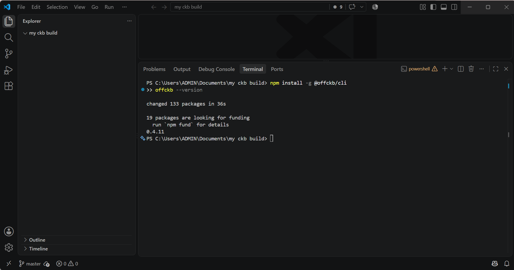
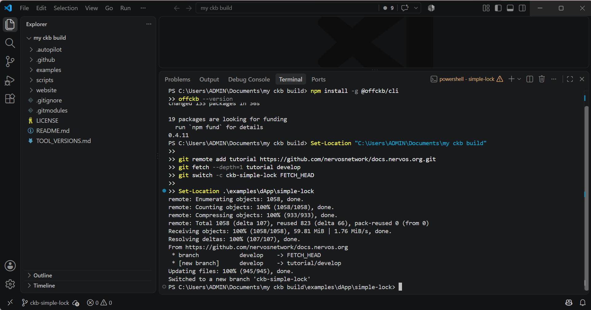
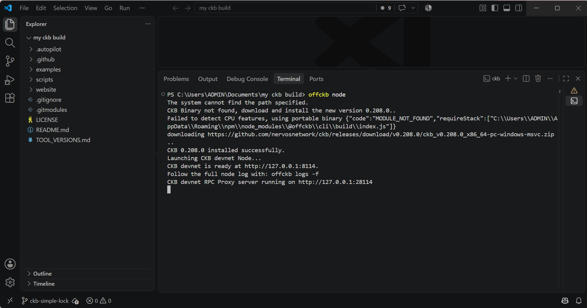
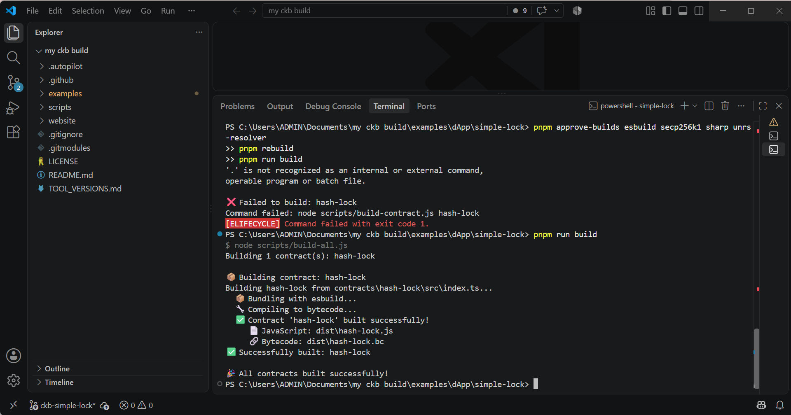
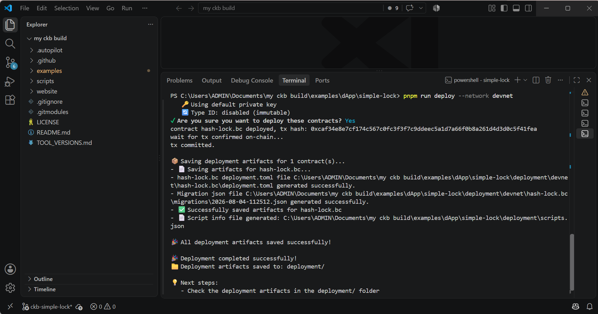
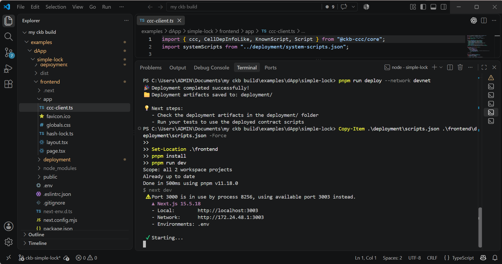
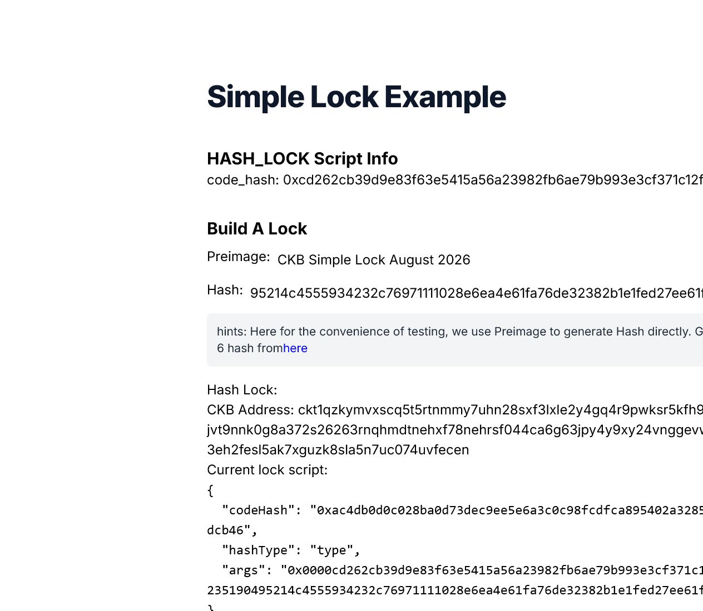
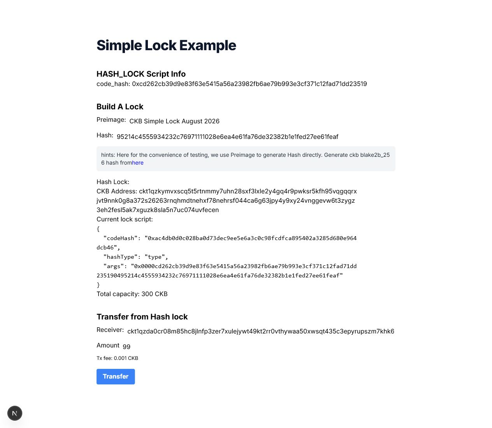
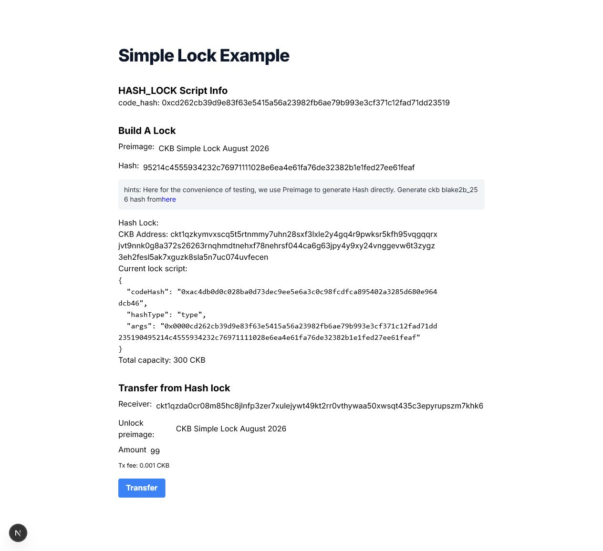
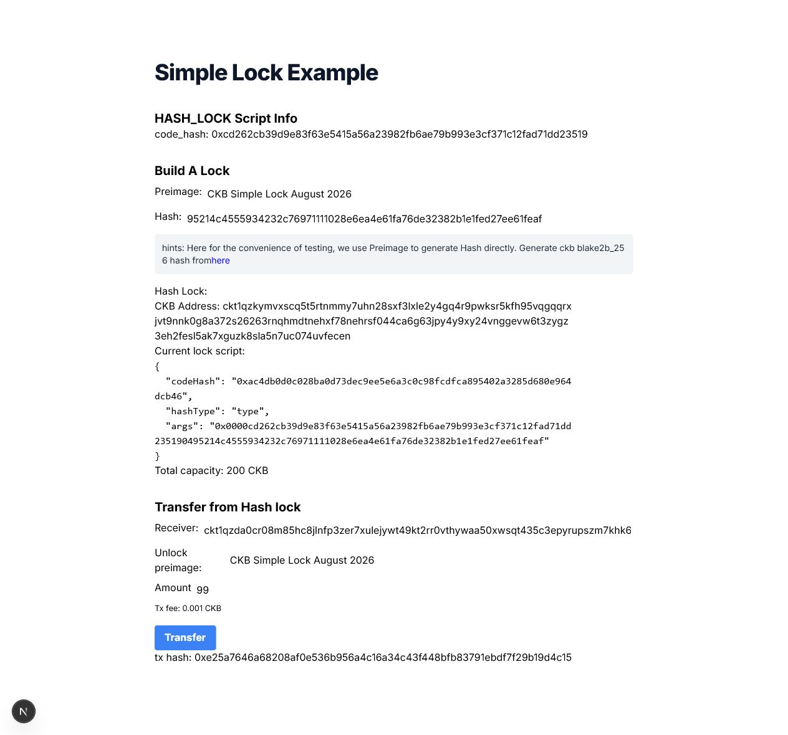

# CKB Simple Lock Campaign Submission

This repository records a complete local Devnet run of the Nervos CKB
[Build a Simple Lock](https://docs.nervos.org/docs/dapp/simple-lock) tutorial
using OffCKB. It contains the `hash-lock` contract, the Next.js dApp used to
create and unlock the lock, deployment artifacts, and ordered proof images.

**Campaign:** [Build on CKB: Campaign #03](https://ckboost.netlify.app/campaign/0x50cc9ec8607c176fe39b20e6f73be4921180eccb2ffa761c4bdab0762e279e7c)<br>
**Submitted by:** [zynorr](https://github.com/zynorr)<br>
**Date:** 2026-08-04

## Completed Results

| Item | Value |
| --- | --- |
| Network | OffCKB Devnet |
| OffCKB version | `0.4.11` |
| Contract | `hash-lock.bc` |
| Contract code hash | `0xcd262cb39d9e83f63e5415a56a23982fb6ae79b993e3cf371c12fad71dd23519` |
| Deployment transaction | `0xcaf34e8e7cf174c567c0fc3f3f7c9ddeec5a1d7a66f0b8a261d4d3d0c5f41fea` |
| Hash-lock address | `ckt1qzkymvxscq5t5rtnmmy7uhn28sxf3lxle2y4gq4r9pwksr5kfh95vqgqqrxjvt9nnk0g8a372s26263rnqhmdtnehxf78nehrsf044ca6g63jpy4y9xy24vnggevw6t3zygz3eh2fesl5ak7xguzk8sla5n7uc074uvfecen` |
| Deposit transaction | `0x06c48136a887e354ffa0357762c0f055d08b3537b502af8851b4eccc5aa4d6c6` |
| Unlock transaction | `0xe25a7646a68208af0e536b956a4c16a34c43f448bfb83791ebdf7f29b19d4c15` |
| Transfer | `99 CKB` |
| Remaining lock capacity | `200.99999 CKB` |
| Unlock status | Committed in block `0x48e3` |

The transaction hashes belong to the local OffCKB Devnet, so they are not
expected to appear on a public CKB explorer.

## Evidence

### 1. OffCKB installed



### 2. Tutorial source checked out



### 3. Local Devnet running



### 4. Hash-lock contract built



### 5. Hash-lock contract deployed



### 6. Frontend running



### 7. Fresh hash lock created



### 8. Hash lock funded

The deposit transaction funded the generated lock with 300 Devnet CKB.



### 9. Frontend prepared to unlock



### 10. Unlock transaction committed

The dApp transferred 99 CKB to the receiver. The committed transaction has a
99 CKB receiver output and a 200.99999 CKB change output protected by the same
hash lock.



## Reproduce Locally

Prerequisites: Node.js, pnpm, Git, and OffCKB.

```powershell
npm install -g @offckb/cli
offckb node
```

Keep the Devnet terminal open. In another terminal, run:

```powershell
pnpm install
pnpm approve-builds esbuild secp256k1 sharp unrs-resolver
pnpm rebuild
pnpm run build
pnpm run deploy --network devnet
Copy-Item .\deployment\scripts.json .\frontend\deployment\scripts.json -Force
Set-Location .\frontend
Copy-Item .\.env.example .\.env -Force
pnpm run dev
```

Open the local URL printed by Next.js. Enter a preimage to create a hash-lock
address, fund it from an OffCKB Devnet account, then enter the same preimage in
the unlock field and transfer more than the minimum cell capacity.

## Implementation Notes

- `contracts/hash-lock/src/index.ts` verifies the witness preimage against the
  hash stored in the lock arguments.
- `frontend/app/hash-lock.ts` assembles and submits the unlock transaction.
- `frontend/app/page.tsx` includes an explicit unlock-preimage field, allowing
  the dApp workflow to be captured clearly without a browser prompt.
- `scripts/build-contract.js` uses the esbuild Node API and `offckb debugger`
  so the tutorial build works on Windows as well as Unix-like environments.
- `scripts/deploy.js` uses a file URL for the ESM entry-point check on Windows.

## Debugging Record

These screenshots preserve intermediate Windows-specific troubleshooting and
are not required in the main proof sequence:

- [First deployment attempt](screenshots/05-first-deploy-attempt.png)
- [Devnet logs and rebuilt contract](screenshots/06-devnet-logs-and-rebuild.png)

## Personal Reflection

> To be written by the campaign entrant in their own words before submitting
> on CKBoost. This section is intentionally not AI-generated.

<!--
CAMPAIGN ENTRANT: Replace this comment with your own words before submitting.
Do not use AI-generated text. Discuss what you personally learned, the Windows
issues you debugged, and your own view of the hash_lock example's weaknesses
and how they could be addressed.
-->

## Source

The starting project is from the official Nervos CKB documentation tutorial.
The local changes and evidence in this repository document this campaign run.
