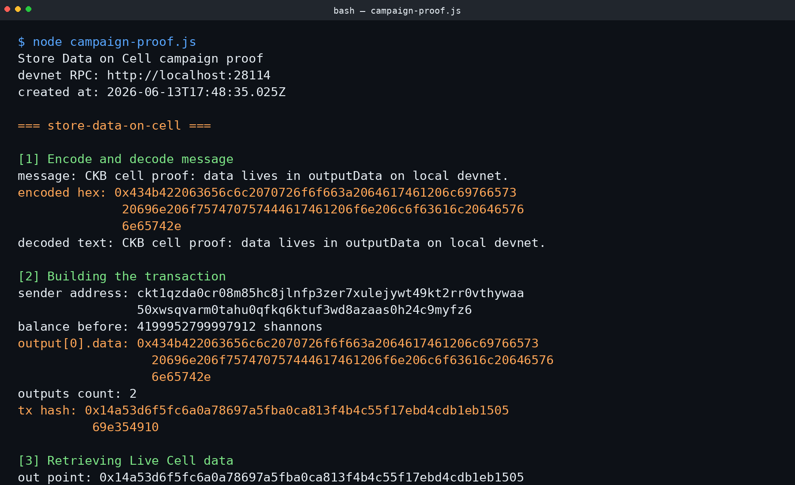
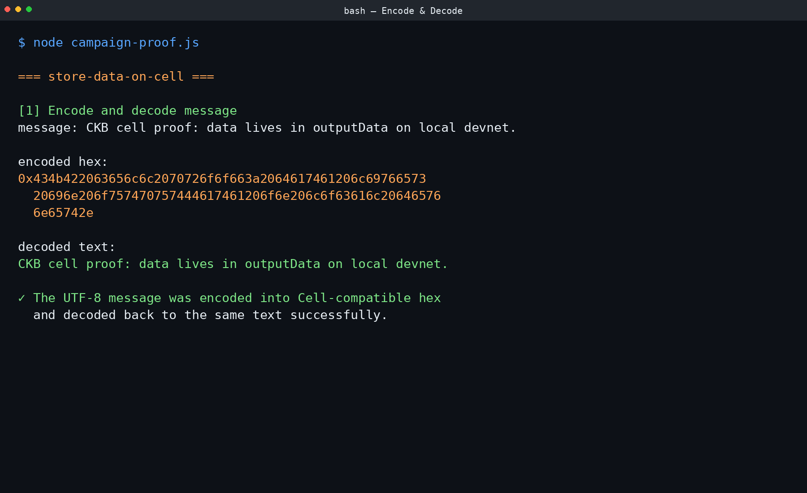
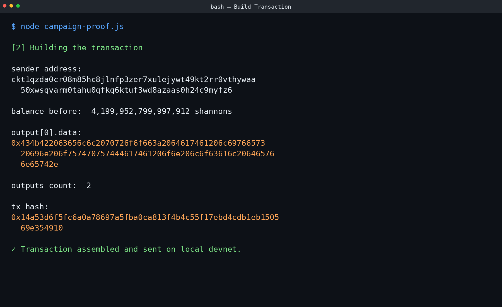
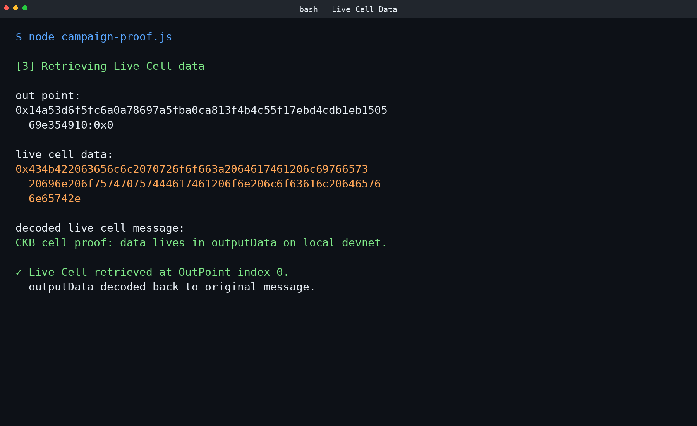

# Build on CKB — Campaign 02: Store Data on Cell

**Quest:** Complete the OffCKB quick start and Store Data on Cell tutorial.  
**Submitted by:** [zynorr](https://github.com/zynorr)  
**Date:** 2026-06-13

---

## Environment

| Setting | Value |
|---|---|
| Tutorial | Store Data on Cell |
| Local chain | OffCKB devnet |
| RPC endpoint | `http://localhost:28114` |
| Script | `node campaign-proof.js` |
| Source | Official Nervos Store Data on Cell tutorial |

---

## Proof Screenshots

| Step | Screenshot |
|---|---|
| Full terminal output | [](screenshots/00-terminal-output.png) |
| Encode & decode message | [](screenshots/01-encode-decode.png) |
| Building the transaction | [](screenshots/02-build-transaction.png) |
| Retrieving Live Cell data | [](screenshots/03-live-cell.png) |

Raw terminal transcript: [`terminal-output.txt`](terminal-output.txt)

---

## Proof Details

### 1. Encode and Decode Message

```text
Message:   CKB cell proof: data lives in outputData on local devnet.
Encoded:   0x434b422063656c6c2070726f6f663a2064617461206c6976657320…
Decoded:   CKB cell proof: data lives in outputData on local devnet.
```

The UTF-8 message was encoded into Cell-compatible hex via `utf8ToHex()` and decoded back to the original text via `hexToUtf8()`.

### 2. Building the Transaction

| Field | Value |
|---|---|
| Sender address | `ckt1qzda0cr08m85hc8jlnfp3zer7xulejywt49kt2rr0vthywaa50xwsqvarm0tahu0qfkq6ktuf3wd8azaas0h24c9myfz6` |
| Output data | `0x434b422063656c6c2070726f6f663a2064617461206c6976657320696e206f757470757444617461206f6e206c6f63616c206465766e65742e` |
| Outputs count | 2 |
| Transaction hash | `0x14a53d6f5fc6a0a78697a5fba0ca813f4b4c55f17ebd4cdb1eb150569e354910` |

The transaction was assembled with the encoded message in `output[0].data`, signed, and sent on the local devnet.

### 3. Retrieving Live Cell Data

| Field | Value |
|---|---|
| Out point | `0x14a53d6f5fc6a0a78697a5fba0ca813f4b4c55f17ebd4cdb1eb150569e354910:0x0` |
| Live cell data | `0x434b422063656c6c2070726f6f663a2064617461206c6976657320696e206f757470757444617461206f6e206c6f63616c206465766e65742e` |
| Decoded message | `CKB cell proof: data lives in outputData on local devnet.` |

The live Cell at output index 0 was retrieved by its OutPoint and the `outputData` was decoded back to the original message, confirming the write/read cycle.

---

## Reflections

Detailed reflections for each step of the process:

| Step | Reflection |
|---|---|
| 1. Encode & Decode | [`reflection-01-encode-decode.md`](reflection-01-encode-decode.md) |
| 2. Build Transaction | [`reflection-02-build-transaction.md`](reflection-02-build-transaction.md) |
| 3. Retrieve Live Cell | [`reflection-03-live-cell.md`](reflection-03-live-cell.md) |

---

## Files

```
├── README.md                          # This submission document
├── proof-output.md                    # Detailed proof output reference
├── terminal-output.txt                # Raw terminal transcript
├── reflection-01-encode-decode.md     # Reflection on step 1
├── reflection-02-build-transaction.md # Reflection on step 2
├── reflection-03-live-cell.md         # Reflection on step 3
└── screenshots/
    ├── 00-terminal-output.png
    ├── 01-encode-decode.png
    ├── 02-build-transaction.png
    └── 03-live-cell.png
```
